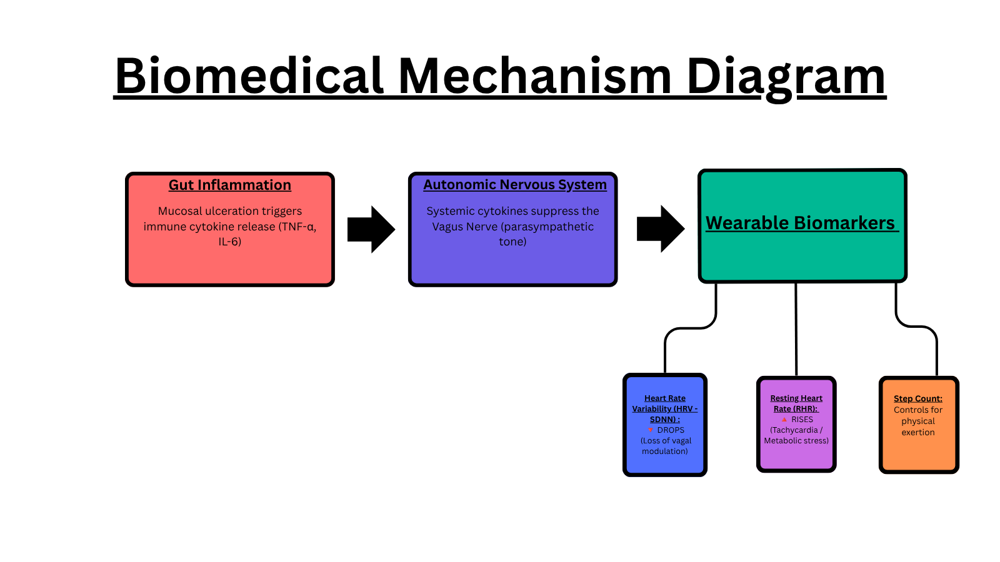

# IBD-Predict: Wearable-Based Flare Prediction for Inflammatory Bowel Disease

An open-source biomedical data pipeline and machine learning project designed to detect early autonomic warning signs of Inflammatory Bowel Disease (Crohn's & Ulcerative Colitis) flare-ups using continuous Apple Watch telemetry.

---

## Clinical Motivation & Background

Inflammatory Bowel Disease (IBD) is a chronic, relapsing autoimmune condition affecting over 400 per 100,000 individuals in North America ([Gros & Kaplan, *JAMA* 2023](https://doi.org/10.1001/jama.2023.15395)). One of these individuals is my sister, who for the past couple of years has been fighting against ulcerative colitis and Crohn's disease.

* **Problems of Current IBD Management:**
    * Advanced biologic therapies only achieve a 30%–60% response rate, leading to unpredictable breakthrough flare-ups and a **20% 5-year hospitalization rate**.
    * Standard disease surveillance relies on invasive colonoscopies or inconvenient fecal calprotectin lab tests performed only every few months or years.
* **The Goal:** Monitor daily health passively with everyday wearables to catch early gut irritation weeks before it turns into a severe emergency.

## 🧬 Biomedical Mechanism: How Smartwatches Detect Gut Inflammation

*Clinical guidelines explicitly define severe Ulcerative Colitis by tachycardia (resting heart rate >90 BPM) alongside systemic toxicity ([Feuerstein & Cheifetz, *Mayo Clinic Proceedings* 2014](https://doi.org/10.1016/j.mayocp.2014.07.002)).*
